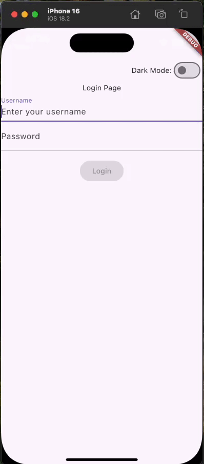

# 登录示例

我们在这个示例中使用 flutter_mvc 完成一个简单的登录页面。



## 项目设置

我们将首先创建一个全新的 Flutter 项目
```bash
flutter create login
```

接下来，安装所有依赖项。

在 `pubspec.yaml` 文件中添加 `flutter_mvc` 依赖：

```yaml
dependencies:
  flutter:
    sdk: flutter
  flutter_mvc: ^5.0.1
```

然后运行 `flutter pub get` 来安装依赖。

## 创建应用状态

我们将创建一个 `AppState` 类来管理应用的全局状态，包括主题模式和登录状态。

```dart
class AppState {
  ThemeMode themeMode = ThemeMode.light;
  bool isLogin = false;
  GlobalKey<NavigatorState> navigatorKey = GlobalKey<NavigatorState>();
}
```

## 创建登录管理器

我们将创建一个 `LoginManager` 类来处理登录逻辑。

```dart
class LoginManager with DependencyInjectionService implements MvcStateListener {
  late final MvcStateScope _stateScope = getService();

  void loginOut() {
    _stateScope.setState(
      (AppState state) {
        state.isLogin = false;
      },
    );
  }

  Future<bool> login(String username, String password) async {
    await Future.delayed(const Duration(seconds: 2));
    if (username != 'admin' || password != 'password') {
      return false;
    }
    _stateScope.setState(
      (AppState state) {
        state.isLogin = true;
      },
    );
    return true;
  }

  @override
  FutureOr dependencyInjectionServiceInitialize() {
    _stateScope.listenState(this, (AppState state) => state.isLogin);
  }

  @override
  void dispose() {
    super.dispose();
    _stateScope.removeStateListener(this);
  }

  @override
  void onMvcStateChanged(Object state) {
    assert(state is AppState);
    final appState = state as AppState;
    if (appState.isLogin) {
      appState.navigatorKey.currentState!.pushReplacement(
        MaterialPageRoute(
          builder: (context) => Scaffold(
            appBar: AppBar(
              title: const Text('Home Page'),
            ),
            body: Center(
              child: Column(
                mainAxisAlignment: MainAxisAlignment.center,
                children: [
                  const Text('Welcome! You are logged in.'),
                  const SizedBox(height: 16),
                  ElevatedButton(
                    onPressed: () {
                      _stateScope.setState(
                        (AppState state) {
                          state.isLogin = false;
                        },
                      );
                    },
                    child: const Text('Logout'),
                  ),
                ],
              ),
            ),
          ),
        ),
      );
    } else {
      appState.navigatorKey.currentState!.pushReplacement(
        MaterialPageRoute(
          builder: (context) => Mvc(
            create: () => LoginController(),
          ),
        ),
      );
    }
  }
}
```

使用依赖注入获取 `MvcStateScope` 实例，由于我们会将`LoginManager`注入到根依赖注入作用域中，因此通过它的依赖注入获取`MvcStateScope`时将会获取到根状态作用域。同时由于`AppState`也在根状态作用域中，因此我们可以通过它来管理`AppState`。

## main

```dart
void main() {
  runApp(
    MvcApp(
      serviceProviderBuilder: (collection) {
        collection.addSingleton((_) => LoginManager());
      },
      onStateScopeCreated: (scope) {
        scope.createState(AppState());
      },
      child: MyApp(),
    ),
  );
}

class MyApp extends StatelessWidget {
  const MyApp({super.key});

  @override
  Widget build(BuildContext context) {
    return Builder(
      builder: (context) {
        final (themeMode, navigatorKey) = context.stateAccessor.useState(
          (AppState state) => (state.themeMode, state.navigatorKey),
        );
        return MaterialApp(
          themeMode: themeMode,
          darkTheme: ThemeData.dark(),
          navigatorKey: navigatorKey,
          home: Mvc(
            create: () => LoginController(),
          ),
        );
      },
    );
  }
}
```

将 `LoginManager` 注入到根依赖注入作用域中，并在根状态作用域创建时创建 `AppState` 状态。

`MaterialApp` 使用 `AppState` 中的 `themeMode` 和 `navigatorKey`。这将会使`AppState`中的`themeMode` 和 `navigatorKey`变化时重建`MaterialApp`。

然后我们使用 `Mvc` 创建 `LoginController`。

### 登录页

#### 登录页状态
```dart
class LoginState {
  String username = '';
  String password = '';
  String? userNameErrorMessage;
  String? passwordErrorMessage;
  String? loginErrorMessage;
  bool loading = false;
  bool get isValid => userNameErrorMessage == null && passwordErrorMessage == null && username.isNotEmpty && password.isNotEmpty;
}
```

#### 登录控制器

```dart
class LoginController extends MvcController with MvcStatefulService<LoginState> {
  void updateUsername(String username) {
    stateScope.setState(
      (LoginState state) {
        state.username = username;
        if (state.userNameErrorMessage != null) {
          state.userNameErrorMessage = validateUsername();
        }
      },
    );
  }

  void updatePassword(String password) {
    stateScope.setState(
      (LoginState state) {
        state.password = password;
        if (state.passwordErrorMessage != null) {
          state.passwordErrorMessage = validatePassword();
        }
      },
    );
  }

  String? validateUsername() {
    if (state.username.isEmpty) {
      return 'Username cannot be empty';
    }
    return null;
  }

  String? validatePassword() {
    if (state.password.isEmpty) {
      return 'Password cannot be empty';
    } else if (state.password.length < 6) {
      return 'Password must be at least 6 characters';
    }
    return null;
  }

  void login() async {
    final String? usernameError = validateUsername();
    final String? passwordError = validatePassword();
    if (usernameError != null || passwordError != null) {
      setState((LoginState state) {
        state.userNameErrorMessage = usernameError;
        state.passwordErrorMessage = passwordError;
      });
      return;
    }
    setState(
      (LoginState state) {
        state.loading = true;
      },
    );
    final loginResult = await getService<LoginManager>().login(state.username, state.password);
    setState(
      (LoginState state) {
        state.loading = false;
      },
    );
    if (!loginResult) {
      if (widgetScope.context.mounted) {
        ScaffoldMessenger.of(widgetScope.context).showSnackBar(
          const SnackBar(content: Text('Login failed. Invalid username or password.')),
        );
      }
    }
  }

  @override
  MvcView<MvcController> view() {
    return LoginView();
  }

  @override
  LoginState initializeState() {
    return LoginState();
  }
}
```

我们使用`MvcStatefulService`来管理登录页的状态`LoginState`。这个 mixin 会自动使用当前依赖注入作用域中的`MvcStateScope`来创建和销毁状态，并且提供 `setState` 方法来更新状态。

通过依赖注入获取`LoginManager`实例来执行登录逻辑。

#### 登录视图

```dart
class LoginView extends MvcView<LoginController> {
  @override
  Widget buildView() {
    return Scaffold(
      body: Column(
        children: [
          SafeArea(
            bottom: false,
            child: Row(
              mainAxisAlignment: MainAxisAlignment.end,
              children: [
                ThemeSwitch(),
              ],
            ),
          ),
          Expanded(
            child: Center(
              child: Column(
                children: [
                  Row(
                    mainAxisAlignment: MainAxisAlignment.center,
                    children: const [
                      Text('Login Page'),
                    ],
                  ),
                  const _UserNameInput(),
                  const _PasswordInput(),
                  const SizedBox(height: 16),
                  const _LoginButton(),
                ],
              ),
            ),
          ),
        ],
      ),
    );
  }
}
```

##### 主题切换组件

```dart
class ThemeSwitch extends StatelessWidget {
  const ThemeSwitch({super.key});

  @override
  Widget build(BuildContext context) {
    final mode = context.stateAccessor.useState(
      (AppState state) => state.themeMode,
    );
    return Row(
      children: [
        Text('Dark Mode:'),
        Switch(
          value: mode == ThemeMode.dark,
          onChanged: (bool value) {
            context.stateScope.setState(
              (AppState state) {
                state.themeMode = value ? ThemeMode.dark : ThemeMode.light;
              },
            );
          },
        ),
      ],
    );
  }
}
```

主题切换组件使用 `AppState` 中的 `themeMode` 来显示当前主题模式，并且允许用户切换主题模式。由于`AppState`在根状态作用域中，因此这个组件可以访问到它。也可以通过该组件中的`context.stateScope`来更新`AppState`中的`themeMode`。

##### 登录表单组件

```dart
class _UserNameInput extends StatelessWidget {
  const _UserNameInput();

  @override
  Widget build(BuildContext context) {
    final controller = context.getService<LoginController>();
    final userNameErrorMessage = context.stateAccessor.useState(
      (LoginState state) => state.userNameErrorMessage,
    );
    return TextField(
      onChanged: (value) {
        controller.updateUsername(value);
      },
      decoration: InputDecoration(
        labelText: 'Username',
        hintText: 'Enter your username',
        errorText: userNameErrorMessage,
      ),
    );
  }
}

class _PasswordInput extends StatelessWidget {
  const _PasswordInput();

  @override
  Widget build(BuildContext context) {
    final controller = context.getService<LoginController>();
    final passwordErrorMessage = context.stateAccessor.useState(
      (LoginState state) => state.passwordErrorMessage,
    );
    return TextField(
      onChanged: (value) {
        controller.updatePassword(value);
      },
      obscureText: true,
      decoration: InputDecoration(
        labelText: 'Password',
        hintText: 'Enter your password',
        errorText: passwordErrorMessage,
      ),
    );
  }
}

class _LoginButton extends StatelessWidget {
  const _LoginButton();

  @override
  Widget build(BuildContext context) {
    final controller = context.getService<LoginController>();
    final (isValid, loading) = context.stateAccessor.useState(
      (LoginState state) => (state.isValid, state.loading),
    );
    return ElevatedButton(
      onPressed: isValid && !loading
          ? () {
              controller.login();
            }
          : null,
      child: loading ? const CircularProgressIndicator() : const Text('Login'),
    );
  }
}
```
使用依赖注入获取 `LoginController` 实例，并使用 `LoginState` 中的状态来显示错误信息和控制登录按钮的可用性。

至此，我们已经实现了相当完善的登录功能，完整源码可以在[这里](https://github.com/yiiim/flutter_mvc/tree/master/examples/login)查看。